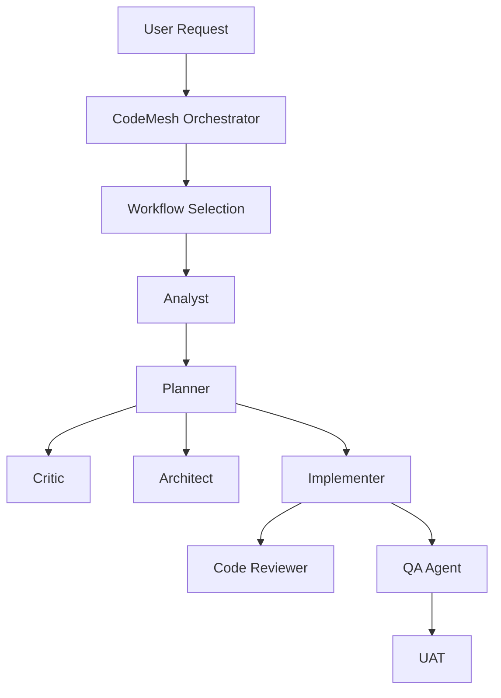

# Architecture Overview

## Mental Model
CodeMesh is an agent-team framework. The core distinction:

```
AGENTS       SKILLS      WORKFLOWS
 WHO WORKS   KNOWLEDGE   HOW THEY
 ON IT       THEY USE    WORK TOGETHER
```

## System Diagram



## Context Flow

```
Repository
 → File discovery
 → Relevance analysis
 → File summaries
 → Context compression
 → Cloud model (only when needed)
```

## Model Routing

```
Simple analysis → Local (Gemma 4B)
Complex implementation → Cloud
```

See `docs/architecture/agent-architecture.md` and `docs/architecture/model-architecture.md` for details.